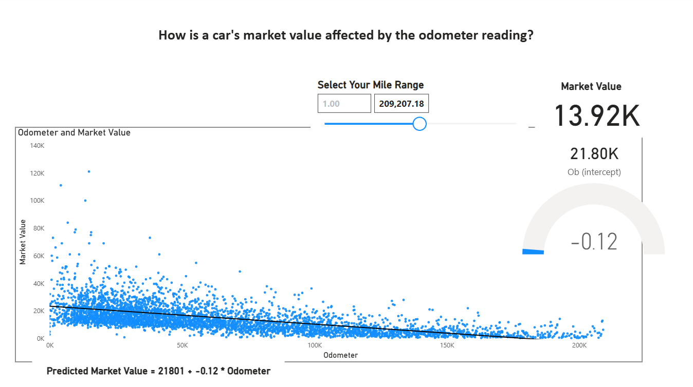
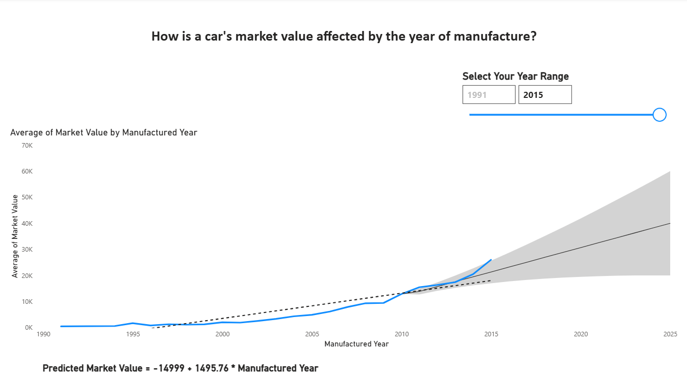
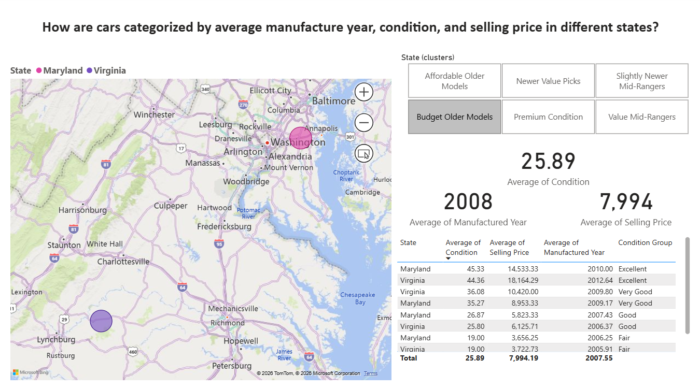
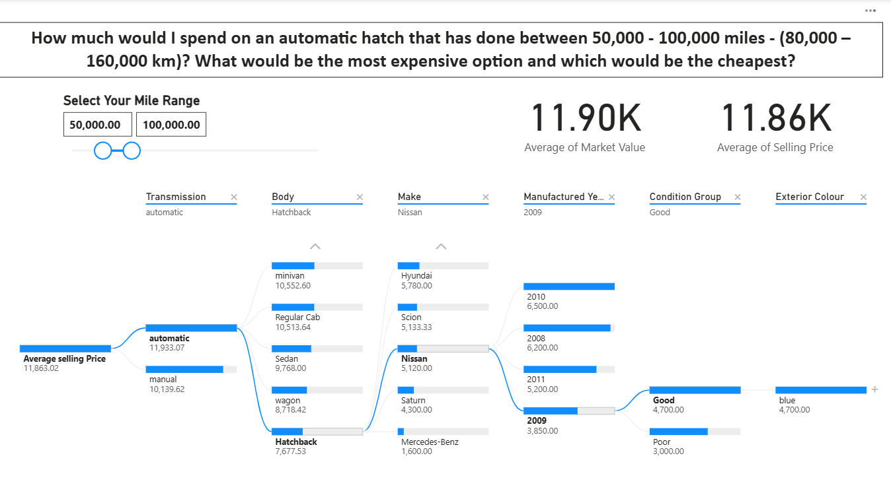

# Car Sales Market Analysis Dashboard

## Project Overview

This project analyses vehicle sales data using advanced analytics techniques in Microsoft Power BI. The aim of the project was to investigate how factors such as manufacture year, vehicle condition, mileage, make, and model affect vehicle market value and selling price.

The project combines:

* Data cleaning and preprocessing using Python
* Data transformation using Power Query
* DAX calculations
* Linear regression and forecasting
* Clustering analysis
* Decision tree analysis using Python in Power BI

The final result is an interactive Power BI dashboard designed to provide insights into vehicle pricing trends and market behaviour.

---
## Dashboard Previews

### Regression Analysis - Odometer vs Market Value

### Regression Analysis - Manufacture Year vs Market Value

### Clustering Analysis

### Decision Tree Analysis

# Dataset

Dataset Source:
[https://www.kaggle.com/datasets/syedanwarafridi/vehicle-sales-data/data](https://www.kaggle.com/datasets/syedanwarafridi/vehicle-sales-data/data)

## Dataset Description

The dataset contains information related to vehicle sales transactions, including:

* Manufacture year
* Make and model
* Vehicle condition
* Odometer reading
* Transmission type
* Vehicle body type
* Selling price
* Market value (MMR)
* State
* Sale date

The original dataset contained over 558,000 records.

---

# Data Cleaning and Preparation

The dataset was preprocessed before analysis.

## Preprocessing Steps

* Removed rows with missing values
* Randomised data
* Reduced dataset size from 558,000+ rows to 5,000 rows for better Power BI performance
* Renamed columns for clarity
* Removed unnecessary columns such as VIN number
* Extracted sale year from text-based date columns using Python
* Converted US state abbreviations into full state names

## Data Quality Improvement

| Dataset          | Error-Free Rate |
| ---------------- | --------------- |
| Original Dataset | 84.52%          |
| Cleaned Dataset  | 100%            |

The cleaned dataset contained:

* No null values
* No duplicate rows
* No invalid numerical ranges

---

# Research Questions and Analysis Methods

## 1. Average Selling Price Analysis

### Question

What is the average selling price of cars based on their condition and make?

### Method

* Power Query
* DAX Expressions

---

## 2. Odometer and Market Value Analysis

### Question

How is a car's market value affected by the odometer reading?

### Method

* Linear Regression
* Trend Analysis

### Key Finding

Vehicle market value decreased by approximately $1,100 for every additional 16,000 km travelled.

Regression Model:

Predicted Market Value = 21147 + (-0.11 × Odometer)

---

## 3. Manufacture Year and Market Value Analysis

### Question

How is a car's market value affected by the year of manufacture?

### Method

* Linear Regression
* Forecasting

### Key Finding

Each newer manufacture year increased vehicle market value by approximately $1,496.

Regression Model:

Predicted Market Value = -14999 + 1495.76 × Manufacture Year

---

## 4. Clustering Analysis

### Question

How are cars categorized by average manufacture year, condition, and selling price in different states?

### Method

* Clustering Techniques

### Cluster Categories

* Premium Condition
* Newer Value Picks
* Slightly Newer Mid-Rangers
* Value Mid-Rangers
* Affordable Older Models
* Budget Older Models

### Key Findings

* Premium clusters contained newer vehicles with higher condition ratings and selling prices.
* Budget clusters mainly contained vehicles manufactured between 2007 and 2008.
* Manufacture year and vehicle brand had stronger influence on price than condition alone.

---

## 5. Decision Tree Analysis

### Question

How much would I spend on an automatic hatch that has done between 80,000 km and 160,000 km? What would be the most expensive option and which would be the cheapest?

### Method

* Decision Tree
* Python in Power BI

### Key Findings

* Average market value: $11.90K
* Average selling price: $11.86K
* Selling prices closely matched predicted market values.
* Newer automatic hatchbacks in good condition consistently achieved higher values.

---

# Key Insights

* Manufacture year had the strongest positive effect on vehicle value.
* Higher odometer readings significantly reduced market value.
* Luxury brands retained high value despite lower condition scores.
* Condition alone was a weaker predictor compared to make and manufacture year.
* Vehicle depreciation was strongest at lower kilometre ranges.

---

# Skills Demonstrated

- Data Cleaning and Preprocessing
- Data Transformation
- Power BI Dashboard Development
- DAX Calculations
- Linear Regression Analysis
- Clustering Techniques
- Decision Tree Analysis
- Predictive Analytics
- Data Visualisation
- Python Scripting
- Exploratory Data Analysis (EDA)
- Business Insight Generation

# Tools and Technologies

* Microsoft Power BI
* Python
* Power Query
* DAX
* Linear Regression
* Clustering Analysis
* Decision Trees

---

# Dashboard Features

The Power BI dashboard includes:

* Interactive filters and slicers
* Trend analysis
* Scatterplots and regression lines
* Cluster visualisations
* Decision tree analysis
* Vehicle segmentation by state

---

# Limitations

* The dataset was reduced to 5,000 rows for performance reasons.
* The data was sourced from the United States market and may not fully represent Australian vehicle trends.
* Some outliers may still influence regression results.
* Market value estimates depend on the quality of the original dataset.

---

# Conclusion

This project demonstrated how advanced analytics techniques in Power BI can be used to identify vehicle pricing trends, market segments, and predictive relationships within large automotive datasets.

The project highlights the importance of data cleaning, transformation, and analytical modelling in supporting data-driven decision-making.
